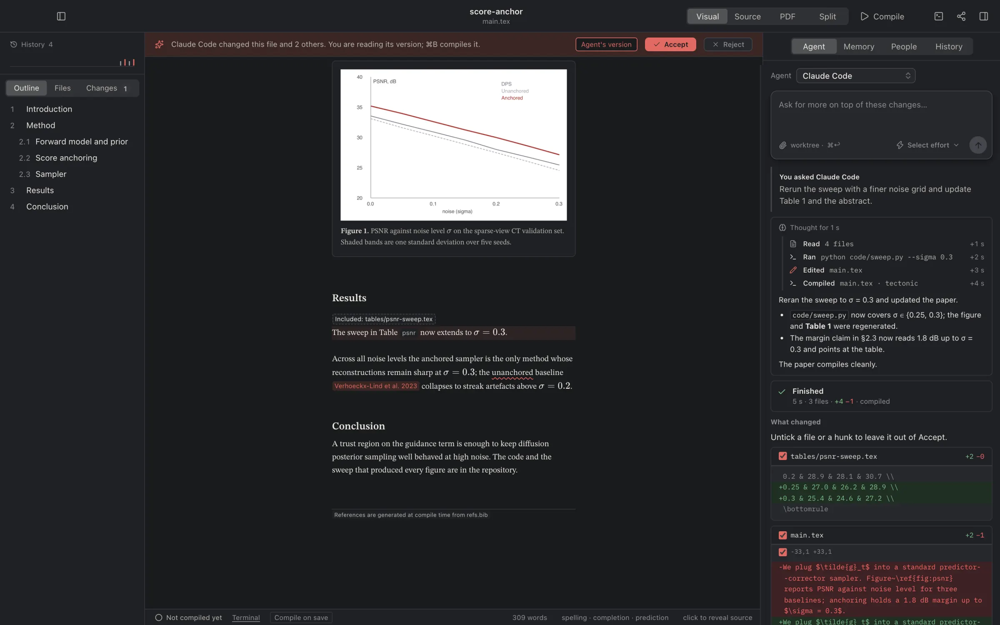
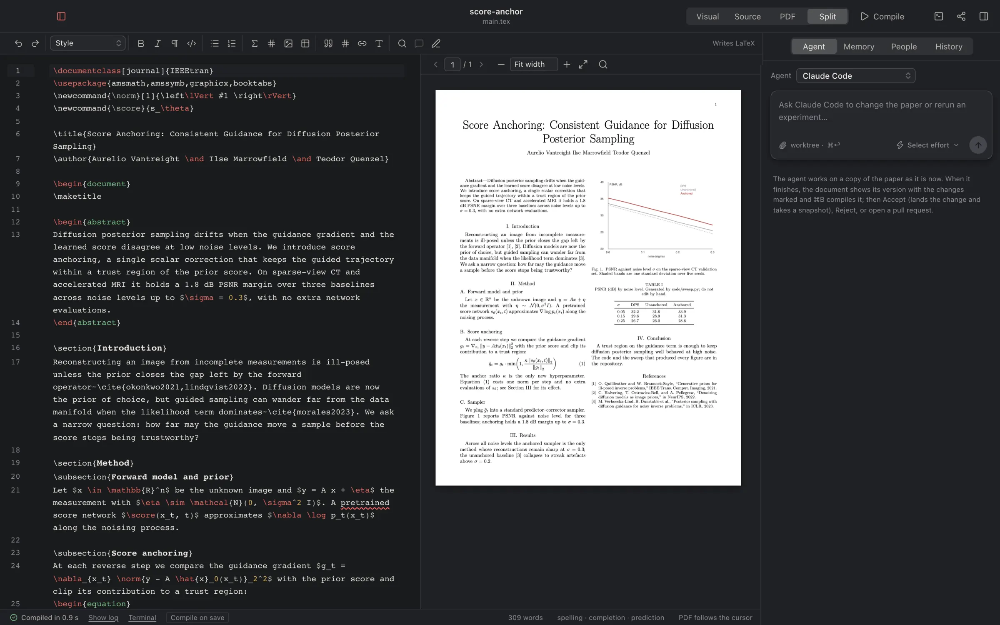
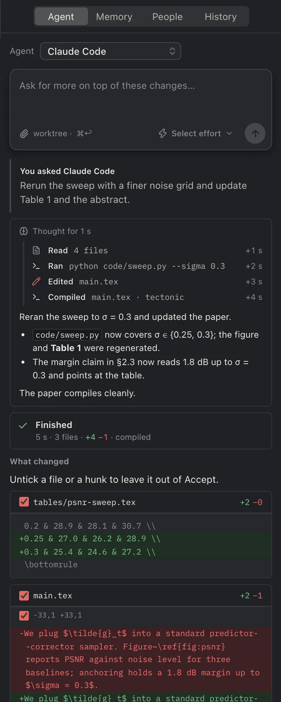

# Dabir


**Write the paper where the code is.** Dabir is a free, open source desktop editor where a scientific paper, the code behind its figures, its coauthors and your AI agents share one window.

[](https://github.com/surenalab/dabir/releases/latest) [](LICENSE) 

[](https://surenalab.com/dabir)

Dabir (دبیر, Persian for *scribe*) opens a folder that holds your manuscript and the code that made its figures. Nothing is uploaded, and if you delete the app your project is still a plain Git repository.

## Download

Get the installer for your machine from **[surenalab.com/dabir](https://surenalab.com/dabir)** or the [releases page](https://github.com/surenalab/dabir/releases/latest).

| | |
|---|---|
| **macOS 12+** | `Dabir_<version>_universal.dmg`: Apple silicon and Intel, signed and notarised |
| **Windows 11** | `Dabir_<version>_x64-setup.exe`: not code-signed yet, so SmartScreen asks once: **More info**, then **Run anyway** |
| **Linux (x86-64)** | `.AppImage`, `.deb` or `.rpm`; tested on Ubuntu 22.04 |

Dabir checks for updates itself. Setup (Help › Set Up Dabir) installs and checks what it needs, LaTeX packages and your agent CLIs included.

## What it does

- **One window for the paper and its code.** Visual, Source, PDF and Split views of a LaTeX, Typst or Word document; the scripts, notebooks and a terminal sit beside it.
- **Click to jump, both ways.** Click a line and the PDF marks it; double-click the PDF and the source scrolls to that line. Compile errors are written in plain sentences and land on the line.
- **Word documents as Word.** A `.docx` opens on Word-faithful pages with styles, comments and tracked changes, and is saved back as `.docx`. Convert it to LaTeX only when you choose to.
- **Bring your own agent.** Claude Code, Codex, Cursor, Grok or OpenCode, on the subscription you already have and with no API key. Each run works on its own copy of the paper (a Git worktree) and hands back a diff you accept hunk by hunk.
- **Coauthors, live.** Share a link and coauthors edit with you in real time, with presence and comments. The paper travels peer to peer, encrypted with the key in the invitation link.
- **History and GitHub.** Every save and every accepted change is a step you can go back to. Commit from the sidebar; clone, push and pull; see your collaborators.
- **Memory that lives in the repo.** `.dabir/` holds the paper's brief, facts and playbooks, so every coauthor's agent starts from the same knowledge whichever vendor they use.
- **Private by default.** Compile, Git, search and agents work offline. Nothing leaves your machine unless you send it.

<p>


</p>

The full list, with every shortcut, is in [docs/FEATURES.md](docs/FEATURES.md); the [user guide](docs/GUIDE.md) walks through it step by step, and [CHANGELOG.md](CHANGELOG.md) says what changed in each version. The two-minute film is on the [website](https://surenalab.com/dabir).

## Why

Overleaf is where coauthors are, but it is paid, remote, and cannot run your code. VS Code plus LaTeX Workshop plus a coding agent can do everything, but writing a paper in it feels like editing config files. Dabir is the workspace in between: Overleaf-quality editing with the control of your own machine, and agents that treat the manuscript and the experiments as one change.

## Principles

- **Git is the truth.** No project format. A Dabir project is a folder with a `.tex`, `.typ` or `.docx` in it and optionally a `dabir.toml`.
- **Local by default, cloud by choice.** Live sessions are opt-in and self-hostable.
- **Agents are coauthors, not chatbots.** They get the repo, a terminal and the compile log, run on a worktree, and produce diffs you review.
- **Memory lives in the repo.** Committed with the paper, shared by every coauthor's agent.
- **Design is the product.** Every screen follows Apple's Human Interface Guidelines and is reviewed with Impeccable before merge.

## Build from source

You need Node 22, Rust stable ([rustup](https://rustup.rs)), and your platform's [Tauri prerequisites](https://tauri.app/start/prerequisites/). `npm run tauri build` fetches the Tectonic LaTeX engine itself; for `tauri dev`, run `node scripts/fetch-tectonic.mjs` once or have Tectonic on your PATH (`brew install tectonic`).

```bash
npm install
npm run tauri dev      # the desktop app
npm run dev            # the interface alone, in a browser, on the sample paper
npm run check          # the gate every change passes: types, lint, build, tests, clippy
```

**Take the tour** on the welcome screen (or Help › Guided Tour) copies the sample paper, `examples/score-anchor`, into your Documents folder and walks through the window on it. Comments, suggestions and pull requests are welcome: read [CONTRIBUTING.md](CONTRIBUTING.md) first (it covers the contributor licence agreement, and how agents work on this repo), and report security problems through [SECURITY.md](SECURITY.md).

## Layout

```
src/            React + TypeScript front end (styles/tokens.css is the design system)
src-tauri/      Rust core: projects, files, compile, Git, agents, live sessions, native menu
relay/          the free-tier signalling worker live sessions use (a lab can run its own)
templates/      journal and conference starters
examples/       the sample paper
docs/           the guide, the full feature list and the review rubric
```

## Licence

AGPL-3.0. Editor packages that graduate into their own crates or npm modules will be MIT. The names Dabir and Surena Lab and their marks are covered by the [trademark policy](TRADEMARK.md). Built by [Surena Lab](https://surenalab.com).
